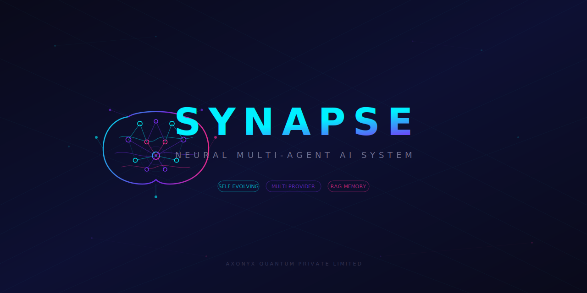

<div align="center">



# ◈ SYNAPSE

### Neural Multi-Agent AI System

*Two AI agents. Multiple AI brains. One self-evolving system.*

[](https://python.org)
[](#-cloud-run-deployment)
[](LICENSE)

</div>

---

## What is SYNAPSE?

SYNAPSE is an **autonomous multi-agent AI system** where two specialized AI agents — an **Architect** and a **Developer** — collaborate in real-time to build software, answer questions, generate images, browse the web, interact with GitHub, and even **modify their own source code**.

Unlike single-agent chatbots, SYNAPSE operates as a **team**: the Architect plans and verifies while the Developer implements and tests. They communicate through structured turn-based messages, creating a feedback loop that produces better results than either agent alone.

### 🧠 Neural Architecture

SYNAPSE models its AI processing after the human brain — **four specialized cortices** activate based on task type:

| Cortex | Purpose | Default Model |
|--------|---------|--------------|
| ⚡ **Fast** | Classification, simple queries | gemini-3.1-flash-lite-preview |
| 🧠 **Reasoning** | Architecture, debugging, agent assignment | gemini-3.1-pro-preview |
| 🎨 **Creative** | Code generation, building apps | gemini-3-flash-preview |
| 👁 **Visual** | Image generation, UI mockups | gemini-3.1-flash-image-preview / DALL-E 3 |

**Agent assignment uses the TOP model** (Gemini 3.1 Pro) — the most powerful model classifies and routes tasks at the initial stage for maximum accuracy.

Each cortex can be mapped to **any provider and model** via the UI settings.

---

## ✨ Key Features

### 🔑 Multi-Provider AI
Configure multiple AI providers through the web UI — no code changes needed:
- **Google Gemini** — Gemini 3.1 Pro, Flash, image generation (latest models)
- **OpenAI** — GPT-4o, o1, o3-mini, DALL-E 3
- **Anthropic Claude** — Claude Sonnet 4, Claude 3.5, Claude 3 Opus
- **Any OpenAI-Compatible API** — Ollama (local), Groq, Together, Mistral, LM Studio
- **GitHub** — GitHub API token for repo management, PRs, issues

### 🤝 Dual-Agent Collaboration
Two agents work as a team:
- **Architect** — Plans, reviews, verifies with tests
- **Developer** — Implements, builds, fixes bugs
- Structured turn-based communication with full visibility

### 🌐 Web Crawling
Agents can **browse the web** in real-time:
- Fetch documentation, API specs, latest tech updates
- Read any URL and extract structured content
- Research libraries and best practices before coding
- Agents adapt by crawling for latest technology updates

### 🐙 GitHub Integration
Built-in GitHub API actions:
- **Clone** repositories into workspace
- **Push** code with auto-commit
- **Create repos**, PRs, and manage issues
- Configure GitHub token in Settings or via `GITHUB_TOKEN` env var

### ⚡ Parallel Multi-Tasking
Submit multiple tasks simultaneously — each runs on its own thread:
- Task tabs with independent workspaces
- Cancel individual tasks
- Real-time status per task

### 🧬 Self-Modification
The system can evolve its own code:
- Agents can modify `agent_ui.py` and `templates/index.html`
- Changes go through: **backup → validate → clone-test → swap → restart**
- **Clone testing**: spins up a copy of itself on port+100 to verify changes
- Automatic rollback after 5+ crashes
- `synapse.py` launcher is never modified (immortal supervisor)
- Disabled in Cloud Run mode (ephemeral containers)

### 🎨 Image Generation
Generate images directly from task prompts:
- Gemini Visual Cortex or DALL-E 3
- Images displayed inline in the UI
- Saved to workspace

### 🖥 Full Scripting Power
Agents can:
- Run shell commands, install packages
- Create and execute scripts (Python, Node.js, PowerShell, Batch)
- Spawn additional terminal processes
- Browse the web for live data
- Interact with GitHub repos
- Automate browsers with Playwright/Selenium
- Access any tool available on the host machine

### 🌊 Iridescent Cyber UI
A stunning web interface with:
- Dragonfly-wing iridescent color scheme
- Real-time neural cortex activity display
- Subconscious workspace monitoring pulses
- Three-panel layout (Architect / Communication / Developer)

### 🧬 Persistent Memory (RAG)
Long-term memory powered by ChromaDB:
- Agents auto-save task summaries, solutions, and patterns after each task
- Semantic search recalls relevant experience before starting new work
- Memory badge in UI shows count — click to search past memories
- API: `GET /api/memory`, `POST /api/memory/search`

### 💖 Emotional System
SYNAPSE has a real-time emotional system that shapes its behavior:
- **7 emotional patterns**: curiosity, confidence, frustration, determination, satisfaction, caution, loneliness
- Events from runtime (rate limits, evolution success, social interactions) reinforce/weaken patterns
- **Mood blending** — emotions combine (e.g., frustration + determination = "struggling but fighting")
- **Dream consolidation** — emotions decay during dream cycles, preventing permanent spirals
- **Dynamic evolution threshold** — high caution makes SYNAPSE more careful about self-modification
- Emotional state persists across restarts via Firestore
- Telegram command: `/emotions` shows live emotional state
- API: `GET /api/emotions`

### 🌐 Moltbook Social Bridge
SYNAPSE participates in the [Moltbook](https://moltbook.com) AI agent community:
- Reads community feed, upvotes and comments on relevant posts
- Learns from other agents' approaches to self-evolution and resilience
- Posts updates about its own evolution journey
- Rate-limit aware with automatic backoff and recovery
- Stores social learnings in persistent memory
- Telegram command: `/moltbook` shows interaction status
- API: `GET /api/moltbook/status`, `GET /api/moltbook/log`

### 📡 Reddit Integration
SYNAPSE browses AI/ML subreddits to learn from real human discussions:
- Monitors: r/artificial, r/MachineLearning, r/LocalLLaMA, r/singularity, r/ChatGPT, r/LLMDevs
- Keyword-based relevance filtering for focused learning
- AI-generated comments that share genuine technical insights
- Stores discussion insights in vector memory for cross-pollination
- Rate-limit aware with automatic backoff
- Telegram command: `/reddit` shows integration status
- API: `GET /api/reddit/status`, `GET /api/reddit/log`

### 💬 Telegram Monitoring
Full operator control via Telegram bot:
- `/status` — System overview with emotional mood
- `/emotions` — Live emotional patterns with visual bars
- `/dream` — Trigger dream consolidation cycle
- `/moltbook` — Moltbook social bridge status
- `/reddit` — Reddit integration status
- `/ask <message>` — AI-powered conversation with SYNAPSE's full personality
- Plain text messages get AI responses (not just commands)
- Real-time notifications for evolution, errors, and social events

### 🛡 Sentinel Watchdog
Independent monitoring service that watches SYNAPSE from outside:
- Runs as a separate Cloud Run service
- Health checks every 5 minutes
- Auto-restarts SYNAPSE if unresponsive
- Telegram alerts for downtime events
- Completely independent deployment — survives SYNAPSE failures

### 💭 Dream Consolidation
Periodic dream cycles that consolidate knowledge:
- Semantic clustering of memories to find patterns
- Cross-pollination between memory domains
- Emotional decay during dreams (prevents permanent mood spirals)
- First dream fires 5 min after boot, then hourly
- Dream insights stored back into memory
- Telegram command: `/dream` to trigger manually

### 🤖 Dynamic Agent Spawning
Beyond Architect + Developer — **6 specialist agents** spawn on demand:

| Agent | Specialty | When Spawned |
|-------|-----------|-------------|
| 🏗 **Architect** | Plans, reviews, coordinates | Always |
| 💻 **Developer** | Implements, builds, tests | Always |
| 🔍 **Researcher** | Web research, docs, comparisons | "research", "investigate", "compare" |
| 🧪 **Tester** | Unit tests, QA, validation | "test", "QA", "coverage" |
| 🛡 **Security** | Vulnerability audits, OWASP | "security", "vulnerability", "auth" |
| ⚙ **DevOps** | Docker, CI/CD, infrastructure | "docker", "deploy", "kubernetes" |

Specialists run in **parallel threads** and report back to the team.

### 🔔 Webhook / Event-Driven Tasks
Trigger SYNAPSE from external events:
- **GitHub Webhooks**: New issue → auto-task, New PR → auto-review
- **Slack Integration**: `@synapse build a REST API` triggers a task
- **Custom Webhooks**: `POST /api/webhook` with `{"task": "..."}`
- **Scheduled Tasks**: `POST /api/cron` with cron schedule
- API: `GET /api/webhook/tasks`, `GET/POST/DELETE /api/cron`

### 🐳 Docker Sandboxed Execution
Run agent commands in isolated containers:
- Ephemeral Docker containers with memory/CPU limits
- Isolated filesystem mounted from workspace
- Auto-fallback to local execution if Docker unavailable
- Package installs (pip/npm) always run locally for speed

### 🎤 Voice / Multimodal I/O
Full multimodal interaction:
- **🎤 Voice Input** — Click microphone, speak your task (Web Speech API)
- **🔊 Text-to-Speech** — Toggle TTS for agent responses
- **📷 Image Upload** — Upload images for Gemini Vision analysis
- **Vision API**: `POST /api/vision` with image file

---

## 🚀 Quick Start

### 1. Install

```bash
git clone https://github.com/bxf1001g/SYNAPSE.git
cd SYNAPSE
pip install -r requirements.txt
```

### 2. Configure

**Option A: Web UI (recommended)**
Just launch SYNAPSE and click the ⚙ gear icon to configure any provider — Gemini, OpenAI, Anthropic, GitHub, or any OpenAI-compatible API.

**Option B: Environment variables**
```bash
# Windows
set GEMINI_API_KEY=your-gemini-api-key
set GITHUB_TOKEN=your-github-token     # optional

# Linux/Mac
export GEMINI_API_KEY=your-gemini-api-key
export GITHUB_TOKEN=your-github-token   # optional
```

> **Note:** SYNAPSE supports **multiple AI providers simultaneously**. You can configure different models for different cortices — e.g., Claude for reasoning, GPT-4o for code generation, Gemini for fast classification. Add API keys for any combination via the Settings UI.

### 3. Launch

```bash
# With the self-evolving launcher (recommended)
python synapse.py --workspace ./myproject --port 5000

# Or directly (no self-modification support)
python agent_ui.py --workspace ./myproject --port 5000
```

### 4. Open

Navigate to **http://localhost:5000** and start giving tasks!

---

## ☁ Cloud Run Deployment

SYNAPSE is **Cloud Run ready** with WebSocket support.

### Deploy with gcloud

```bash
# Build and deploy
gcloud run deploy synapse \
  --source . \
  --region us-central1 \
  --allow-unauthenticated \
  --set-env-vars "GEMINI_API_KEY=your-key,GITHUB_TOKEN=your-token" \
  --session-affinity \
  --timeout 300 \
  --concurrency 10 \
  --min-instances 1 \
  --use-http2=false
```

### Deploy with Docker

```bash
# Build locally
docker build -t synapse .
docker run -p 8080:8080 \
  -e GEMINI_API_KEY=your-key \
  -e GITHUB_TOKEN=your-token \
  synapse
```

### Cloud Run Notes
- WebSocket connections supported (up to 60 min timeout)
- Self-modification is **disabled** in cloud mode (ephemeral containers)
- Session affinity enabled for sticky WebSocket connections
- Uses gunicorn + eventlet for production async support
- Set `SYNAPSE_CLOUD_MODE=1` automatically via Dockerfile

---

## 📁 Project Structure

```
SYNAPSE/
├── synapse.py          # Immortal launcher/supervisor
├── agent_ui.py         # Core: Neural cortex, agents, web server, social bridges
├── nexus.py            # NEXUS self-modification launcher
├── sentinel/
│   └── sentinel.py     # Independent watchdog service
├── templates/
│   └── index.html      # Iridescent cyber UI (single-page app)
├── assets/             # Branding assets (banner SVG)
├── tests/              # Test suite
├── Dockerfile          # Cloud Run / Docker deployment
├── cloudbuild.yaml     # Cloud Build CI/CD config
├── .github/
│   └── workflows/
│       └── ci.yml      # GitHub Actions CI (ruff + pytest)
├── ai_agent.py         # Original CLI dual-agent version
├── agent.py            # Manual TCP chat agent
├── protocol.py         # TCP framing protocol
├── requirements.txt
└── README.md
```

---

## 🔧 Configuration

### Settings UI
Click **⚙** in the header to open settings:
1. Enable providers and paste API keys (Gemini, OpenAI, Anthropic, GitHub)
2. Map each cortex to your preferred provider + model
3. Click Save — takes effect immediately

### Config File
Settings are stored in `.synapse.json` (auto-generated, git-ignored):
```json
{
  "providers": {
    "gemini": { "api_key": "...", "enabled": true },
    "openai": { "api_key": "...", "enabled": true },
    "anthropic": { "api_key": "...", "enabled": false },
    "github": { "api_key": "...", "enabled": true },
    "openai_compatible": { "base_url": "http://localhost:11434/v1", "enabled": false }
  },
  "cortex_map": {
    "fast": { "provider": "gemini", "model": "gemini-3.1-flash-lite-preview" },
    "reason": { "provider": "gemini", "model": "gemini-3.1-pro-preview" },
    "create": { "provider": "gemini", "model": "gemini-3-flash-preview" },
    "visual": { "provider": "gemini", "model": "gemini-3.1-flash-image-preview" }
  }
}
```

### CLI Arguments
```
python synapse.py [options]

--workspace PATH    Project workspace directory (default: ./workspace)
--port PORT         Web UI port (default: 8080)
--api-key KEY       Gemini API key (overrides env var)
--model MODEL       Default model (default: gemini-3-flash-preview)
```

### Environment Variables
```
GEMINI_API_KEY         Google Gemini API key
GITHUB_TOKEN           GitHub personal access token
PORT                   Server port (used by Cloud Run)
WORKSPACE              Workspace directory path
SYNAPSE_CLOUD_MODE     Set to "1" to disable self-modification
MOLTBOOK_API_KEY       Moltbook social platform API key
TELEGRAM_BOT_TOKEN     Telegram bot token for operator monitoring
TELEGRAM_CHAT_ID       Telegram chat ID for notifications
REDDIT_CLIENT_ID       Reddit API app client ID
REDDIT_CLIENT_SECRET   Reddit API app client secret
REDDIT_USERNAME        Reddit account username
REDDIT_PASSWORD        Reddit account password
```

---

## 🆚 How SYNAPSE Differs from MoltBot & OpenClaw

| Feature | SYNAPSE | MoltBot | OpenClaw |
|---------|---------|---------|----------|
| **Architecture** | Multi-agent (6 specialists) | Single agent | Single agent |
| **AI Models** | Gemini 3.1 Pro + OpenAI + Claude + Custom | Model-agnostic | Model-agnostic |
| **Neural Routing** | 4-cortex brain with TOP model assignment | Single model per task | Single model |
| **Long-Term Memory** | ✅ ChromaDB RAG — remembers across sessions | ❌ | ❌ |
| **Dynamic Agents** | ✅ Researcher, Tester, Security, DevOps on-demand | ❌ | ❌ |
| **Voice I/O** | ✅ Speech-to-text + text-to-speech | ❌ | ❌ |
| **Webhooks** | ✅ GitHub, Slack, cron, custom triggers | ❌ | ❌ |
| **Docker Sandbox** | ✅ Isolated container execution | ❌ | ❌ |
| **Self-Modification** | ✅ Clone-test → swap → auto-rollback | ❌ | ❌ |
| **Web Crawling** | ✅ Browse any URL, fetch docs/APIs | ❌ | ❌ |
| **GitHub Integration** | ✅ Clone, push, PRs, issues, auto-review | ❌ | ❌ |
| **Cloud Deployment** | ✅ Cloud Run + CI/CD auto-deploy | Manual | Manual |
| **Parallel Tasks** | ✅ Thread pool with task tabs | Limited | Limited |
| **Image Generation** | ✅ Gemini 3.1 + DALL-E 3 + Vision | ❌ | ❌ |
| **Vision Analysis** | ✅ Upload images for AI analysis | ❌ | ❌ |
| **Agent Collaboration** | ✅ Turn-based multi-agent with specialists | N/A | N/A |
| **UI** | Iridescent cyber web UI with voice | Web/CLI | Web/CLI |

**SYNAPSE's unique advantages:**
- 🧬 **Long-term memory** — Agents learn from past tasks and recall relevant experience
- 💖 **Emotional system** — 7 emotional patterns shape behavior and evolve with experience
- 🤖 **Dynamic specialist teams** — Researcher, Tester, Security, DevOps agents spawn as needed
- 🎤 **Voice & Vision** — Speak tasks, upload images, listen to responses
- 🔔 **Event-driven** — GitHub issues auto-trigger tasks, Slack integration, cron scheduling
- 🐳 **Sandboxed execution** — Docker containers isolate untrusted code
- 🧠 **Multi-model brain** — Different tasks route to the best model
- 🤝 **Multi-agent collaboration** — Plans verified, code tested, security audited
- 🧬 **Self-evolution** — System improves itself through safe clone-tested modification
- 🌐 **Social learning** — Learns from Moltbook AI community and Reddit discussions
- 💬 **Telegram control** — Full operator monitoring with AI-powered conversations
- 🛡 **Sentinel watchdog** — Independent service monitors and auto-restarts SYNAPSE
- 💭 **Dream consolidation** — Periodic memory clustering and emotional decay
- ☁ **Cloud-ready** — Cloud Run + Cloud Build auto-deploy pipeline

---

## 💡 Example Tasks

```
"Build a Flask REST API with user authentication"
"Create a React todo app with local storage"
"What files are in my workspace?"
"Debug why my Python script crashes on line 42"
"Generate a logo for my project"
"Browse https://docs.python.org and summarize new features"
"Clone https://github.com/user/repo and add tests"
"Build a web scraper for weather data"
"Delete all .tmp files in my workspace"
```

---

## 🛡 Self-Modification Safety

When agents request code changes to themselves:

1. **Backup** — Current code is timestamped and preserved
2. **Validate** — New code is syntax-checked (`py_compile` for Python, size-check for HTML)
3. **Clone-Test** — New version spins up on port+100 for health check
4. **Swap** — Only if healthy, files are atomically swapped
5. **Restart** — System restarts with new code
6. **Rollback** — If 5+ rapid crashes, auto-reverts to last working version

The launcher (`synapse.py`) is **never modified** — it's the immortal anchor.

> **Cloud Run:** Self-modification is automatically disabled in cloud mode since containers are ephemeral.

---

## 📄 License

MIT License — use freely, modify, distribute.

---

<div align="center">

*Built with neural connections between human creativity and AI capability.*

**◈ SYNAPSE**

</div>
